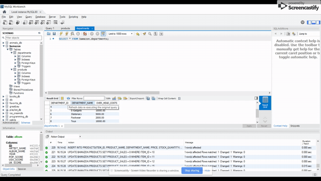

# Bamazon

## Summary
Bamazon application is similar to that of amazon that customers can buy stuffs via this application. Customers can view total amount they had paid upon exit. At a next level, manager or supervisor can look into bamazon's status. Manager's view and Supervisor's view are authenticated so that no customer can have those access.

## Installation Guide
* User has to download all files from GitHub repository
* User can either clone the repository or can download all files manually unzipping might take a while though
* Package.json file has required depencies to be installed. So, user can type `npm install` to install all needed packages
* User can type `node bamazonCustomer.js` to have customer view and purchase stuffs
* User can type `node bamazonManager.js` to have manager view of the application
* User can type `node bamazonSupervisor.js` to have supervisor view of the application
* ``app.sql`` file contains schemas and values to be inserted to have a view of application

## Technologies Used
- Javascript : used to provide interactive effects
- Node : used to run javascript file outside the browser. Supports command line user input. Node is useful is different ways. As
far as this code is concerned, utilised inquirer to dynamically prompt question to user. Used mysql npm package to create schemas.

## Customer View
To have a customer view type command `node bamazonCustomer.js` in command line. Functioning of application is shown below


> The above code shoots out the existing products from bamazon. Customers can choose id of the product to make purchase. Customers can make multiple purchases and at the end, they will be kept informed with the total amount they spent in purchasing stuffs

## Manager View
To have a manager view type command `node bamazonManager.js` in command line. Functioning of application is shown below.


> The above code execution asks for username and password from Manager that authenticates him/her to proceed further. Application doesn't allow further access unless and until Manager provides correct password. Manager has access to view product sales for all products. Manager also has ability to add/delete new product. Also, manager can view the low inventory available so that new inventories can be added.

## Supervisor View
To have a supervisor view of the application type command `node bamazonSupervisor.js` in command line


> The above code execution asks for username and password from Supervisor that authenticates him/her to proceed further. Supervisor has the ability to add a new department. Supervisor can view profit/loss status of all departments.



> New Department that was added can be seen

## Code Snippet
*bamazonCustomer.js*
```Javascript
// Function to check if item is available in table
function check(id, number){
    // Selects stock_quantity from products table
    connection.query("SELECT STOCK_QUANTITY FROM PRODUCTS WHERE ITEM_ID=?",[id],function(err,result){
        if(err) throw err;
        for(var i=0; i<result.length; i++){
        
        // If stock is minium, then alerts user insufficient quantity
        if(number > result[i].STOCK_QUANTITY){
            console.log(chalk.red("\nSORRY. INSUFFICIENT QUANTITY. ORDER CAN'T BE PLACED NOW"));
            console.log(chalk.yellow("\nTRY PURCHASING OTHER STUFFS WHILE WE RELOAD!\n"));
            // For insufficient quantity, prompts user if they wish to continue
            ifContinue();
        }
        else if(number <= result[i].STOCK_QUANTITY){
            var newStock = result[i].STOCK_QUANTITY - number;
            // Update new stock value
            updateTable(id, newStock, number);
        }
    }
        
    })
}
```
Table is scanned and checked if sufficient quantity is enough to fullfil customer's order. If stock falls less to what customer asked for, then application alerts the customer of insufficient quantity.

*bamazonManager.js*
```Javascript
// Function to display Low inventories
function viewLowInventory(){
    connection.query("SELECT * FROM PRODUCTS WHERE STOCK_QUANTITY < 5",function(err, result){
        if(err) throw err;
        var table = new Table({ head: ["ITEM_ID", "PRODUCT_NAME", "DEPARTMENT_NAME", "PRICE", "STOCK_QUANTITY", "PRODUCT SALES"] });
        for(var i=0; i<result.length; i++){
            // Construct table
            table.push(
                [result[i].ITEM_ID, result[i].PRODUCT_NAME, result[i].DEPARTMENT_NAME, result[i].PRICE, result[i].STOCK_QUANTITY, result[i].PRODUCT_SALES] 
            );
        }

        // Display table to screen
        console.log(table.toString());
        // To ask question to user
        askQuestions();

    })
    
}
```
Displays low inventory data to the view of manager when asked for. As far as this application is concerned, low inventory indicates products that have stock quantity less than 5.

*bamazonSupervisor.js*
```Javascript
// Function to display product sales
function viewProductSales(){

    // Query to inner join two tables
    var query = "SELECT DEPARTMENTS.DEPARTMENT_ID, DEPARTMENTS.DEPARTMENT_NAME, DEPARTMENTS.OVER_HEAD_COSTS, SUM(PRODUCTS.PRODUCT_SALES) AS PRODUCT_SALES, ";
        query += "(SUM(PRODUCTS.PRODUCT_SALES) - DEPARTMENTS.OVER_HEAD_COSTS) AS TOTAL_PROFIT "
      query += "FROM DEPARTMENTS INNER JOIN PRODUCTS ON (DEPARTMENTS.DEPARTMENT_NAME = PRODUCTS.DEPARTMENT_NAME ";
      query += ") GROUP BY DEPARTMENTS.DEPARTMENT_NAME ORDER BY DEPARTMENTS.DEPARTMENT_ID";

      connection.query(query, 
    function(err, result){
        if(err) throw err;
        var table = new Table({ head: ["DEPARTMENT_ID", "DEPARTMENT_NAME", "OVER_HEAD_COSTS", "PRODUCT_SALES", "TOTAL_PROFIT"] });

        for(var i=0; i<result.length; i++){

            table.push(
                [result[i].DEPARTMENT_ID, result[i].DEPARTMENT_NAME, result[i].OVER_HEAD_COSTS, result[i].PRODUCT_SALES, result[i].TOTAL_PROFIT] 
            );
            }
            // Display table to screen
            console.log(table.toString());
            // To ask question to supervisor
            askQuestion();
     
});
}
```
The above code displays profit for each department when supervisor asks for

## Learning Points
* Gained hands-on experience in mysql npm node package
* Researched and implemented various npm packages like cli-table, chalk to give a decent look on the terminal

## Future Enhancement
A future enhancement could be made to this application on manager/supervisor view is that either manager/supervisor has to have the ability to rollback a deletion that was made earlier.

## Author Links
[LinkedIn](https://www.linkedin.com/in/mahisha-gunasekaran-0a780a88/)

[GitHub](https://github.com/Mahi-Mani)
